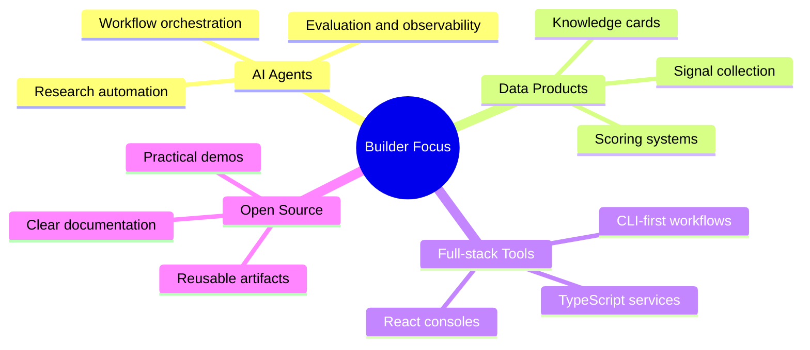

# Hi, I'm `sunrisefromdark`

AI Agent ecosystem builder | TypeScript full-stack developer | Data workflow tinkerer

## About

I build tools that turn messy public signals into structured, verifiable, and reusable products.

My current focus is **AI Agent infrastructure and ecosystem intelligence**: collecting signals, scoring projects, generating research artifacts, and building web consoles that help people understand what is actually moving in the market.

- Building [AgentRadar](https://github.com/sunrisefromdark/agentRadar), an open-source trend radar and research workbench for the AI Agent ecosystem
- Interested in Agent workflows, data pipelines, knowledge systems, observability, and practical productization
- Comfortable moving between backend logic, frontend console UX, CLI workflows, and research-oriented automation
- Previously explored Java-side tooling and data integration ecosystems through TubeMQ / Apache InLong-related work

## Tech Stack

**Main tools I use**

`TypeScript` | `Node.js` | `React` | `PostgreSQL` | `Kysely` | `Vitest` | `OpenAI SDK` | `Anthropic SDK` | `pnpm` | `GitHub Actions`

## Featured Project

<table>
  <tr>
    <td width="55%">
      <h3><a href="https://github.com/sunrisefromdark/agentRadar">AgentRadar</a></h3>
      

        An open-source trend radar and research workbench for the AI Agent ecosystem.
        It collects public signals, normalizes data, scores projects, generates daily and weekly reports,
        builds knowledge cards, and exposes the outputs through a local / hosted web console.
      

      

        <a href="https://app.agentradar.top/">Live app</a> |
        <a href="https://github.com/sunrisefromdark/agentRadar">Repository</a>
      

    </td>
    <td width="45%">
      
<strong>Stack</strong>

      
TypeScript, React, Node.js, PostgreSQL, Kysely, Vitest

      
<strong>Highlights</strong>

      
Daily radar, weekly synthesis, observer pool, knowledge cards, hosted app

      

        
        
      

    </td>
  </tr>
</table>

**What it demonstrates**

- End-to-end data workflow design: collection, normalization, scoring, reporting, verification, and reuse
- AI-assisted research artifacts: daily reports, weekly trend synthesis, observer pools, and knowledge cards
- Product thinking: hosted app, local console, readable README, and clear OSS / hosted boundaries
- Engineering discipline: TypeScript codebase, test coverage, typed schemas, CLI commands, and production build checks

## What I Like Building

## Public Work Snapshot

## For Recruiters

If you are looking for someone who can connect **AI product sense**, **data workflow engineering**, and **full-stack implementation**, my best sample is [AgentRadar](https://github.com/sunrisefromdark/agentRadar).

I am especially interested in roles around:

- AI Agent products / developer tools
- Data platforms and research automation
- Backend / full-stack engineering with TypeScript
- Open-source or product-led engineering teams

## Contact

- GitHub: [@sunrisefromdark](https://github.com/sunrisefromdark)
- Live project: [app.agentradar.top](https://app.agentradar.top/)

Thanks for visiting. If AgentRadar looks useful, a star would make my day.

<!-- Profile README refresh marker: 2026-07-04 -->
